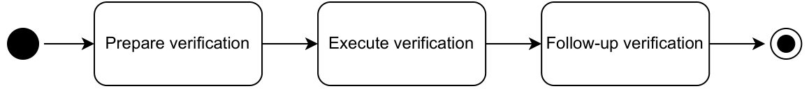
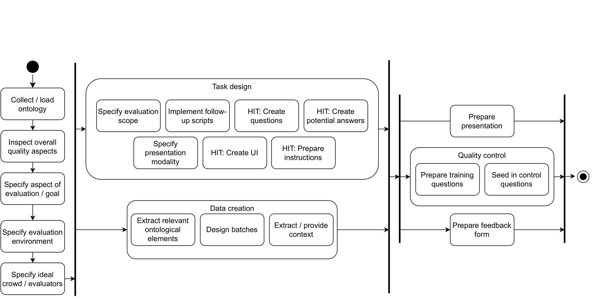
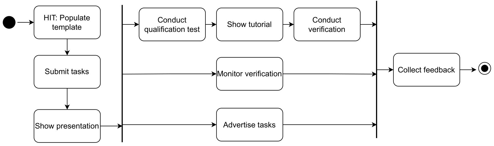

# "VeriCoM 2.0" - Process Models of Human-Centered Ontology Verification
## Overview Process Model

## Preparation Activites

## Execution Activites

## Follow-Up Activites

### Remarks
For a further description please to the write-up of the thesis.
